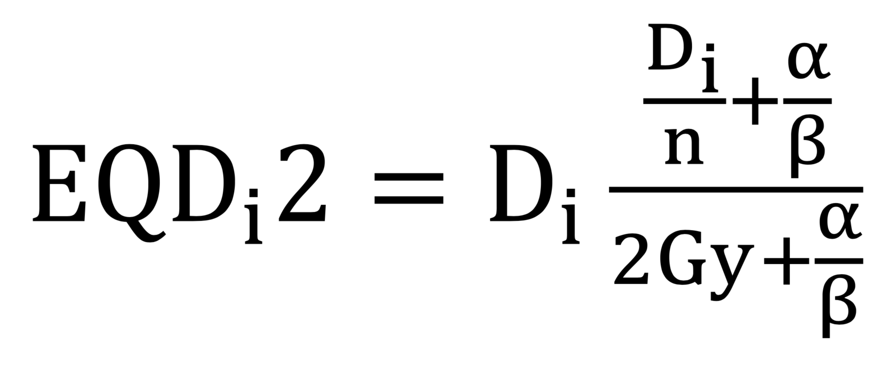

## PyEQD2
Use Python to convert a DICOM-RT dose distribution to its Linear Quadratic Equivalent Dose in 2-Gy Fractions (LQED2, EQD2), according to the equation:




#### Example (Main Functions)
```
import pyeqd2 as eqd

dicompath = '/Users/macuser/Downloads/testfile.dcm'

a = eqd.RTDose(dicompath)   # load dicom-rt file
a.plot()                    # get a glimpse
a.plot_legend()             # interpret the glimpse

fractions = 8                       # number of fractions
abratio = 3                         # alpha/beta ratio
a.make_eqd2(fractions, abratio)     # conversion
a.export()                          # save as new dicom-rt file
```

#### Example (Other Commands)
```
# Multiply the entire dose distribution before or after conversion:
factor = 8
a.multiply(factor)
```

#### Requirements:
Python 3 Standard Library with the additional packages [Matplotlib](https://github.com/matplotlib/matplotlib), [NumPy](https://github.com/numpy/numpy), [pydicom](https://github.com/pydicom/pydicom).
